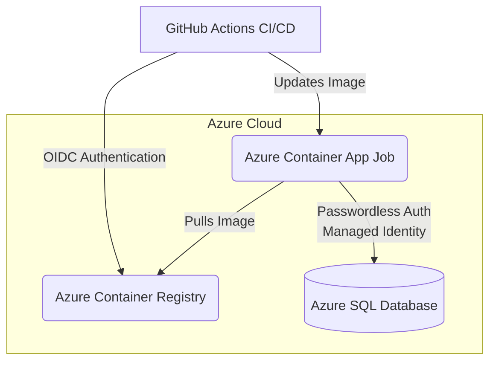
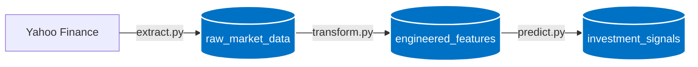

# Oslo Børs Pipeline

An automated, end-to-end ML pipeline that fetches monthly stock data for a set of Oslo Børs (Oslo Stock Exchange) tickers, engineers cross-sectional return-prediction features, trains an ensemble of models, and generates monthly BUY/HOLD investment signals. The entire infrastructure is provisioned as code (IaC) on Microsoft Azure, utilizing Zero-Trust Passwordless Security and Secretless CI/CD deployments.
## Cloud Architecture & DevOps

The infrastructure is entirely provisioned using **Terraform** on Microsoft Azure.



### Key Engineering Features

- **Infrastructure as Code (IaC):** The entire Azure environment is defined and managed using Terraform (`infrastructure/`), ensuring complete reproducibility.
- **Zero-Trust Database Authentication:** No database passwords are hardcoded or stored in environment variables. The Container App uses a **User-Assigned Managed Identity** to authenticate with Azure SQL via Microsoft Entra ID.
- **Secretless CI/CD (OIDC):** The GitHub Actions workflow (`.github/workflows/`) uses OpenID Connect (OIDC) Federation to securely log into Azure.

## How it works

The pipeline runs in three phases, orchestrated by `main.py`:

1. **Extraction** (`extract.py`) — Pulls the latest monthly OHLCV data for a fixed set of Oslo Børs tickers from Yahoo Finance (`yfinance`), computes raw and adjusted monthly returns, and appends any new rows to the `raw_market_data` table in Azure SQL (skipping dates already present).
2. **Feature Engineering** (`transform.py`) — Reads all raw market data and builds a "gold layer" of ML-ready features per ticker per month, including:
   - Size and liquidity proxies (`log_size`, `turnover`)
   - Momentum and reversal signals (`rev_1m`, `mom_6m`, `mom_12m`)
   - Rolling volatility (`vol_3m`, `vol_6m`)
   - Winsorized, cross-sectionally z-scored target and features, ready for modeling
   
   Output is written to the `engineered_features` table.
3. **Inference** (`predict.py`) — Trains an ensemble of three models (Ridge regression, Random Forest, XGBoost) on all historical engineered features, predicts next-period returns for the most recent month, ranks tickers by predicted return, and flags the top 10 as `BUY` (all others `HOLD`). Results are saved to the `investment_signals` table.

### Data Flow


### Tickers tracked

| Yahoo Ticker | ISIN |
|---|---|
| EQNR.OL | NO0010096985 |
| DNB.OL | NO0010161896 |
| TEL.OL | NO0010063308 |
| YAR.OL | NO0010208051 |
| NHY.OL | NO0005052605 |

## Architecture

```
extract.py  --->  raw_market_data        (Azure SQL)
                        |
                        v
transform.py --->  engineered_features   (Azure SQL)
                        |
                        v
predict.py   --->  investment_signals    (Azure SQL)
```

All three scripts can also be run standalone for debugging (each has its own `if __name__ == "__main__":` block), or chained together via `main.py`.

## Tech Stack

- **Data:** `yfinance` for market data ingestion
- **Storage:** Azure SQL, via `SQLAlchemy` + `pyodbc` (passwordless auth using Azure Managed Identity)
- **Features:** `pandas`, `numpy`
- **Modeling:** `scikit-learn` (Ridge, Random Forest) and `xgboost`
- **Containerization:** Docker (Python 3.11-slim + MS ODBC Driver 18)
- **Automation:** GitHub Actions workflow for scheduled/CI runs
- **Infrastructure:** Terraform for provisioning Azure resources

## Getting started

### Prerequisites

- Python 3.11+
- An Azure SQL database
- An Azure Managed Identity (or equivalent) with access to that database
- ODBC Driver 18 for SQL Server installed locally (or run via Docker, see below)

### Environment variables

Create a `.env` file in the project root with:

```
AZURE_SQL_SERVER=<your-server>.database.windows.net
AZURE_SQL_DATABASE=<your-database-name>
AZURE_CLIENT_ID=<managed-identity-client-id>
```

### Install dependencies

```bash
pip install -r requirements.txt
```

### Run the full pipeline

```bash
python main.py
```

### Run an individual phase

```bash
python extract.py     # fetch + load raw market data only
python transform.py   # (re)build engineered features from raw data
python predict.py     # train models + generate signals from engineered features
```

### Run with Docker

```bash
docker build -t oslo-bors-pipeline .
docker run --env-file .env oslo-bors-pipeline
```

## Database Schema

The pipeline relies on strict SQL schemas to prevent data corruption. The pipeline expects the following tables to exist:

```sql
CREATE TABLE raw_market_data (
    TradeDate DATE NOT NULL,
    Ticker VARCHAR(50) NOT NULL,
    OpenPrice FLOAT,
    HighPrice FLOAT,
    LowPrice FLOAT,
    ClosePrice FLOAT,
    Volume BIGINT,
    PRIMARY KEY (TradeDate, Ticker)
);

CREATE TABLE engineered_features (
    TradeDate DATE NOT NULL,
    Ticker VARCHAR(50) NOT NULL,
    mom_12m FLOAT,
    vol_6m FLOAT,
    log_size FLOAT,
    -- (Additional z-scored features mapped here)
    PRIMARY KEY (TradeDate, Ticker)
);

CREATE TABLE investment_signals (
    TradeDate DATE NOT NULL,
    Ticker VARCHAR(50) NOT NULL,
    PredictedReturn FLOAT,
    Signal VARCHAR(10),
    ConfidenceScore FLOAT,
    PRIMARY KEY (TradeDate, Ticker)
);
```

## Testing

```bash
pip install -r requirements_test.txt
pytest test_pipeline.py
```

## Project structure

```
.
├── .github/workflows/     # CI/CD automation
├── infrastructure/        # IaC for Azure resources (Terraform)
├── Dockerfile
├── extract.py             # Phase 1: data ingestion
├── transform.py           # Phase 2: feature engineering
├── predict.py             # Phase 3: model training + signal generation
├── main.py                # Orchestrates the full monthly run
├── test_pipeline.py
├── requirements.txt
└── requirements_test.txt
```

## Future Enhancements & Optimizations

While the current pipeline is fully functional, an enterprise-scale version would benefit from the following architectural evolutions:

*   **Incremental Data Loading (Delta Loads):** Currently, `transform.py` recalculates rolling features for the entire historical dataset. As data volume grows, this should be optimized to only fetch, calculate, and upsert the most recent month of data (incremental processing) to reduce compute time and database I/O.
*   **Data Quality Validation:** Implementing a tool like *Great Expectations* or *Pydantic* between the extract and transform phases to ensure data types, check for missing values, and validate schema integrity before writing to Azure SQL.
*   **Always-On Serving API:** Building a lightweight web server (e.g., FastAPI) and deploying it to Azure Container Apps to expose the `investment_signals` table to end-users via secure REST endpoints.

## Disclaimer

This project is for educational/research purposes. The generated BUY/HOLD signals are model outputs based on historical price data and are **not financial advice**.

## License

_Add a license (e.g. MIT) if you intend to share this publicly._
